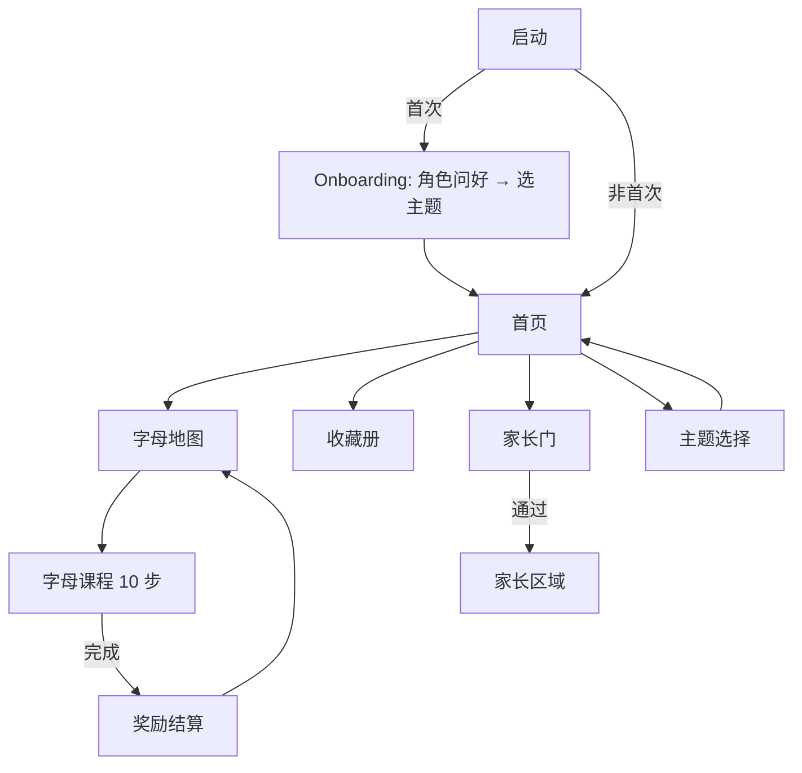

# USER_FLOW — 页面流程与导航

版本：1.0 ｜ 关联：[PRODUCT_SPEC](PRODUCT_SPEC.md) · [LEARNING_MODEL](LEARNING_MODEL.md) · [DESIGN](DESIGN.md)

## 1. 路由表（go_router）

| 路径 | 页面 | 说明 |
|---|---|---|
| `/onboarding` | Onboarding | 仅首次启动；选主题（2 步内） |
| `/home` | 首页 | 角色欢迎 + 进入字母地图/收藏册/设置入口 |
| `/themes` | 主题选择 | 6 张主题卡，当前主题高亮 |
| `/map` | 字母地图 | A–Z 路径图，星星进度 |
| `/lesson/:letter` | 字母课程 | 10 步流程（页内步进，非路由步进） |
| `/rewards` | 收藏册 | 贴纸/徽章/收藏品 |
| `/parent-gate` | 家长门 | 长按 3 秒或简单算术题 |
| `/parent` | 家长区域 | 进度报告 + 设置（家长门之后） |

导航原则：儿童侧最多 2 层深度（首页 → 地图 → 课程）；返回按钮始终在左上角同一位置；系统返回手势正常工作；课程中退出需二次轻确认（防误触，非阻碍）。

## 2. 主流程

## 3. 关键页面要点

### Onboarding（≤2 步，零文字依赖）
1. 默认主题角色挥手 + 语音欢迎（"Hi! Let's learn ABC!"）
2. 六主题卡横向滑动选择（角色 + 场景缩略图，无文字标签依赖，语音播报主题名）→ 点击即进入首页
- 不收集任何信息；跳过选择则用默认主题（星际探索站）

### 首页
- 全屏主题场景 + 主角色（可点击触发待机动作/彩蛋）
- 一个明显主按钮：进入字母地图（"Play" 图标 + 语音）
- 次级入口（小而不抢焦点）：收藏册、主题切换、家长门（右上角，儿童不易触发样式）

### 字母地图
- 主题化路径（星轨/化石小径/传送带/花园小路/云梯/甜点桌）
- 26 节点：已完成显示星数；未学显示字母本身（不加锁图标，全部可进）
- 当前推荐字母有角色站位提示
- 横竖屏与平板均单屏或轻滚动，节点触控 ≥64dp

### 课程页
- 页内步进（PageView/状态机），顶部细进度点（非压力型进度条）
- 全程语音引导；主发音按钮 ≥88dp；重听按钮常驻
- 左上返回（轻确认）；右上跳过当前步（仅描线等可选步显示）

### 家长门
- 提示（成人文案）：“请长按按钮 3 秒进入” 或 “3 + 4 = ?” 三选一
- 连续失败 3 次冷却 30 秒；门失败不发出羞辱性反馈

## 4. 音频规则（全局）

- 同一时刻仅一条语音；新语音打断旧语音
- 路由切换 → 停止当前语音；BGM 淡出淡入
- 语音播放时 BGM 自动降至 20% 音量（ducking）
- BGM 开关在家长区 + 首页小图标双入口
